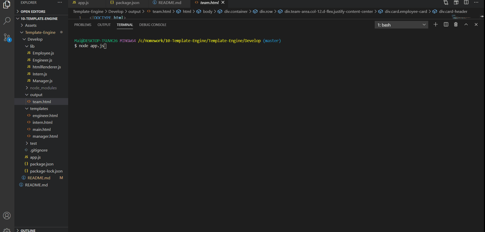

# Employee roster Generator

## About the project


A command-line application that prompt user for some information about their employee. The application will also create resources specific for Managers, Engineers and Interns. 

---

## Getting started
Below are the prerequisite understanding and programs that were utilized :
* Visual Studio Code-click [here](https://code.visualstudio.com/) to a tutorial to install
* Github repository-click [here](https://help.github.com/en/github/)
* node.js and its file system [here](https://nodejs.org/en/)
* inquirer [here](https://www.npmjs.com/package/inquirer)
* utility [here](https://www.npmjs.com/package/utility)
* jest [here](https://jestjs.io/docs/en/getting-started)

---

## Code spotlight

The code snippet below demonstrate how to create a synchronous call of function that will also generate role-specific questions by evaluating what the provided 'role' is. This function will also continue to perform this set of work as long as the user want to continue to add employees.
```js
{

    async function generateProfile(){
    try {
        let wantsToCont = true;
        while (wantsToCont){
            const employeeProfile = await promptQs();
            const {name, id, email, role} = employeeProfile;
            console.log(employeeProfile);

            switch(role){
}

```
---

## Demo



---

## Deployed link

[Live site](https://mtbanh.github.io/Template-Engine)


---

## Author

**Mai Banh**
- [Link to Github](https://github.com/mtbanh)
- [Link to LinkedIn](https://www.linkedin.com/in/mai-banh-311ba6164/)

See also the list of [contributors](https://github.com/your/project/contributors) who participated in this project.

## Acknowledgments
Thank you to my tutor, Matthew Chen.